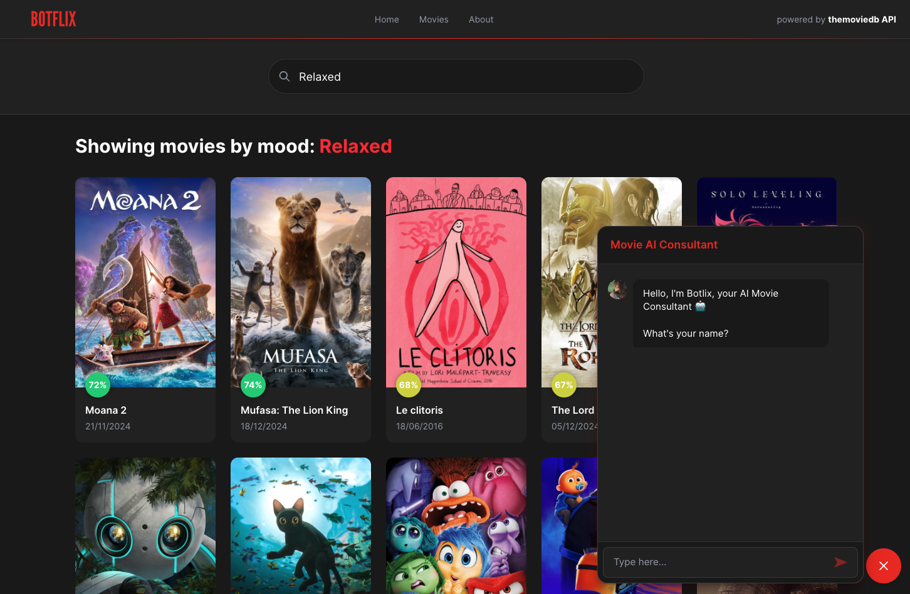

<div align="center">
  <h1> Botflix - Movie AI Consultant </h1>
  <br><br>
  
  <br>
  <br>
  <p> Final result </p>
    <p><strong><a href="https://botflix.vercel.app/" target="_blank" rel="noopener noreferrer">https://botflix.vercel.app/</a></strong></p>
  <br>
</div>

## **📖 Description**

Botflix is a movie search app that integrates with a bot to search for movies based on emotions. Users can interact with the bot to get personalized recommendations.

---

## **🚀 Final Result**

Check out the live version of the app:
👉 [botflix.vercel.app](https://botflix.vercel.app/)

---

## 📚 Documentation

👉 [Project Overview](src/docs/project-overview.md)

## **📜 Prerequisites**

- **Node.js**: Version 22 or above is recommended.\
  Check your Node version with:
  ```bash
  node -v
  ```
- **NVM**: Use Node's Long-Term Support version:
  ```bash
  nvm use -lts
  ```

---

## **📂 Folder Structure**

```
botflix/
│
├── docs/
├── src/
│ ├── app/
│ │ ├── hooks/
│ │ └── providers/
│ │
│ ├── features/
│ │ ├── chat/
│ │ │ ├── components/
│ │ │ └── index/
│ │ │
│ │ └── search/
│ │ ├── components/
│ │ ├── types/
│ │ └── index/
│ │
│ ├── shared/
│ │ ├── components/
│ │ ├── hooks/
│ │ ├── pages/
│ │ ├── types/
│ │ ├── utils/
│ │ └── index/
│ │
│ └── assets/
│ ├── images/
│ └── styles/
│
├── public/
│ └── images/
│
└── README.md
```

- `app/`: Contains global configuration and providers for the application.
- `features/`: Main application domains, each with its components, hooks, services, etc.
- `shared/`: Reusable elements like UI components, hooks, and utilities.
- `assets/`: Static resources such as images, icons, and styles.

---

## **💻 Available Scripts**

In the project directory, after cloning the repository and installing the dependencies, you can use the following commands:

### **Install Dependencies**

```bash
npm install
```

### **Start the Development Server**

Runs the app in development mode:

```bash
npm start
```

- Open [http://localhost:5173](http://localhost:5173) to view it in the browser.
- The page will reload automatically if you make changes.
- You will also see lint errors in the console.

### **Run Tests**

Launch the test runner in interactive watch mode:

```bash
npm test
```

### **Fix Linter and Formatting Issues**

To format the code and fix linting issues:

```bash
npm run format
npm run lint:fix
```

---

## **🛠 Tech Stack**

- **React with TypeScript**: For building the UI.
- **RESTful API**: For fetching movie data.
- **React Custom Hooks**: For encapsulating reusable logic.
- **React Router**: For managing navigation.
- **TanStack Query**: For efficient data fetching and caching.
- **Tailwind CSS**: For styling components.
- **Styled Components**: For custom, dynamic styles.
- **Unit Testing**: For ensuring code reliability.
- **JSDoc 3**: For documentation generation.

---

## **🌳 GIT Flow**

We use the following branching strategy:

- `master`: Stable production-ready branch.
- `develop`: Integration branch for features.
- `feature-branch`: Specific branches for new features or improvements.
- `hotfix`: For urgent bug fixes in production.

### Useful Commands:

- **Rebase**:
  ```bash
  git rebase <branch-name>
  ```
- **Cherry-pick**:
  ```bash
  git cherry-pick <commit-hash>
  ```

---

## **💡 Future Improvements**

- Integrate more emotion-based filtering.
- Add user authentication for personalized recommendations.
- Improve bot interaction using NLP models.
- Add Navlink in header section
- Add pagination for multiple results

---

### **👏 Contributing**

Feel free to submit issues or pull requests. Any contribution is appreciated!

---

### **📄 License**

This project is licensed under the MIT License.

---

### **✨ Notes**

If you encounter any issues, please open a GitHub issue or reach out to the maintainers.

---

## **🔗 Links**

- [Project Repository](https://github.com/david-portilla/botflix)
- [Live Demo](https://botflix.vercel.app/)

---

### **👨‍💻 Author**

This project was created by [David Portilla](https://davidportilla.com/).
