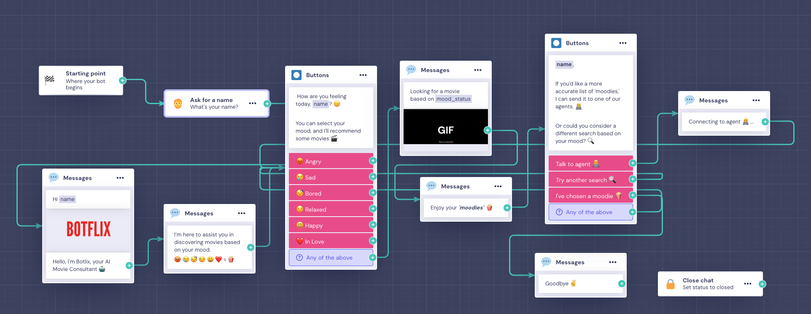

# Project Overview:

The goal is to search for a movie that matches your mood. The project operates as follows:

1. Traditional Search: Users can use a search bar to find any movie of their choice.

2. Chat Feature:
   The chat begins by asking the user for their name and mood.
   Based on the mood provided, the system recommends a list of movies that may interest the user.

3. Additional Interaction:
   If the user is not satisfied with the suggestions, the chat provides the option to speak with an agent. If the user agrees, they are transferred to a WhatsApp chat for a more personalized interaction.

This flow is depicted in a flowchart shown in the image "Landbot Flow."

